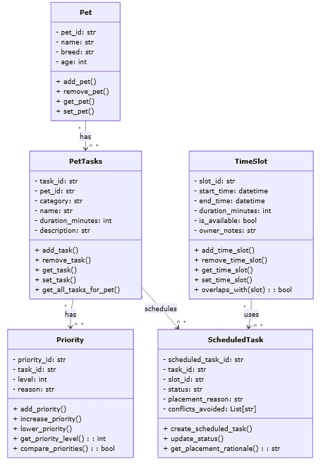

# PawPal+ Project Reflection

## 1. System Design

**a. Initial design**

The Pawpal initial UML takes in a Pet object to create pet tasks, each task will have a priority as well as details to schedule the task. The scheduled task willl have timeslots for how long the task will take.

**b. Design changes**

My UML did change, but before implementation. I realized that there needed to be a separate class that handled the scheduling due to priorities for certain tasks when I was designing the UML.

---

## 2. Scheduling Logic and Tradeoffs

**a. Constraints and priorities**

- What constraints does your scheduler consider (for example: time, priority, preferences)?
- How did you decide which constraints mattered most?
The scheduler considers priority first, because the most important priority is critical for pet health (highest being most severe, eg needing medical attention)
then, the scheduler will consider time to do a task and then preferences
**b. Tradeoffs**

- Describe one tradeoff your scheduler makes.
A tradeoff that the scheduler makes is that if it considers priority first, it wont reflect the time taken for the priority
- Why is that tradeoff reasonable for this scenario?
This is a reasonable tradeoff because importance is properly reflected from the priority.

---

## 3. AI Collaboration

**a. How you used AI**

- How did you use AI tools during this project (for example: design brainstorming, debugging, refactoring)?
- What kinds of prompts or questions were most helpful?
I used AI for brainstorming what I could use for the different activities. I found that prompts that were most helpful was asking what are some basic functionalities that I should consider for the given task.

**b. Judgment and verification**

- Describe one moment where you did not accept an AI suggestion as-is.
- How did you evaluate or verify what the AI suggested?
The UML was one moment when I did not accept the AI suggestion as is, it did not specifically have a class for the Scheduler which would use the scheduled tasks and order them. 
---

## 4. Testing and Verification

**a. What you tested**

- What behaviors did you test?
The features that I tested were
- Why were these tests important?

**b. Confidence**

- How confident are you that your scheduler works correctly?
- What edge cases would you test next if you had more time?

---

## 5. Reflection

**a. What went well**

- What part of this project are you most satisfied with?

**b. What you would improve**

- If you had another iteration, what would you improve or redesign?

**c. Key takeaway**

- What is one important thing you learned about designing systems or working with AI on this project?
